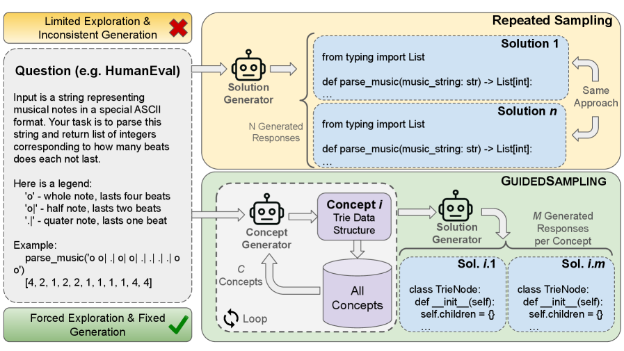
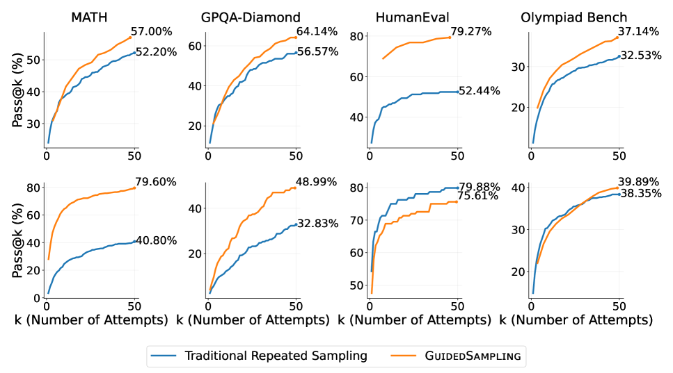

# GuidedSampling: Steering LLMs Towards Diverse Candidate Solutions at Inference-Time

## Overview
Repeated Sampling (RS) is a simple inference-time algorithm that has been shown to improve model performance on complex tasks. Although it is an effective way of scaling inference time, it often struggles to generate diverse solution candidates, frequently relying on the same underlying approach to solve the problem and thus producing redundant samples. To address this limitation, we propose a new inference algorithm, GuidedSampling, which decouples the exploration and generation phases during inference, increasing diversity of generated candidate solutions. The exploration phase identifies multiple concepts that can be utilized to solve the problem, while the generation phase applies a specific concept to provide final solution candidates. We first define the theoretical bounds of GuidedSampling and then empirically demonstrate that it improves the performance of base model at pass@50 by on an average ~21.6% across various benchmarks compared to RS. Furthermore, models trained on trajectories of GuidedSampling exhibit substantial performance improvements at pass@5 by on an average ~9.7%, compared to models trained on traditional RS. Additionally, models trained with GuidedSampling increases the average number of concepts per instance (1.67 -> 3.03), yielding a diverse set of candidates than traditional RS.





## Directory Structure

```
├── README.md                            # This file
├── requirements.txt                     # Python dependencies
├── finetuning.py                        # Supervised fine-tuning script
├── finetuning.sh                        # Training shell script
├── trained_models/                      # Fine-tuned model checkpoints
├── src/
│   ├── sampling_inference/              # Core inference implementations
│   │   ├── vllm_inference.py            # Base inference class
│   │   ├── humaneval_inference.py       # HumanEval-specific inference
│   │   ├── olympiadbench_inference.py   # OlympiadBench-specific inference
│   │   ├── math_inference.py            # MATH-specific inference
│   │   └── gpqa_inference.py            # GPQA-Diamond-specific inference
│   ├── concept_extractor.py             # Concept extraction from responses
│   ├── concept_calculator.py            # Concept diversity analysis
│   └── keys/                            # API keys
│       ├── huggingface.key              # Huggingface token
│       └── wandb.key                    # Wandb token
└── data/
    ├── graphs/                          # Analysis visualizations
    ├── humaneval.jsonl                  # HumanEval dataset
    ├── olympiad_bench.jsonl             # OlympiadBench dataset
    ├── gpqa_diamond.jsonl               # GPQA-Diamond dataset
    └── math.jsonl                       # Math dataset
```

## Installation

1. **Clone the repository**:
   ```bash
   git clone https://github.com/DivijH/sampling_inference.git
   cd sampling_inference
   ```

2. **Install dependencies**:
   ```bash
   pip install -r requirements.txt
   ```

3. **Set up Hugging Face authentication**:
   ```bash
   # Add your Hugging Face token to src/keys/huggingface.key
   echo "your_hf_token_here" > src/keys/huggingface.key
   ```

## Usage

### 1. Random Sampling (RS)

Generate responses using standard random sampling:

```bash
cd src/sampling_inference
python humaneval_inference.py \
    --model "meta-llama/Llama-3.2-3B-Instruct" \
    --input-file "../../data/humaneval.jsonl" \
    --output-file "../../data/responses/llama-3.2-3b-instruct/humaneval_rs_10.json" \
    --number-samples 10 \
    --cuda-visible-devices "0"
```

### 2. Guided Sampling (GS)

Generate responses using concept-guided sampling:

```bash
cd src/sampling_inference
python humaneval_inference.py \
    --model "meta-llama/Llama-3.2-3B-Instruct" \
    --input-file "../../data/humaneval.jsonl" \
    --output-file "../../data/responses/llama-3.2-3b-instruct/humaneval_gs_5_20.json" \
    --max-ideas 5 \
    --number-responses-per-idea 20 \
    --cuda-visible-devices "0"
```

### 3. Concept Extraction

Extract concepts from generated responses:

```bash
cd src
python concept_extractor.py \
    --model "Qwen/Qwen2.5-32B-Instruct" \
    --input-file "../data/validated/llama-3.2-3b-instruct/olympiad_bench_rs_100.jsonl" \
    --output-file "../data/concepts/qwen2.5-32b-instruct/olympiad_bench_rs_100_concepts.jsonl" \
    --cuda-visible-devices "3"
```

### 4. Concept Analysis

Analyze concept diversity:

```bash
cd src
python concept_calculator.py
```

### 5. Model Fine-tuning

Fine-tune models using generated data:

```bash
python finetuning.py \
    --model_name "meta-llama/Llama-3.2-3B-Instruct" \
    --data_path "data/responses/llama-3.2-3b-instruct/humaneval_gs_5_20.jsonl" \
    --output_dir "./trained_models/gs_fine_tuned_llama_model" \
    --batch_size 1 \
    --learning_rate 1e-5 \
    --epochs 5
```


<!-- ## Citation

If you use this code in your research, please cite:

```bibtex
@article{handa2025guidedsampling,
  title={GuidedSampling: Steering LLMs Towards Diverse Candidate Solutions at Inference-Time},
  author={Handa, Divij and Parmar, Mihir and RRV, Aswin and Uddin, Md Nayem and Palangi, Hamid and Baral, Chitta},
  journal={arXiv preprint arXiv:2510.03777},
  year={2025}
}
``` -->
